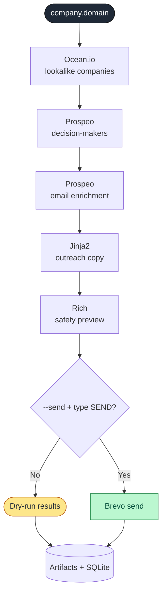
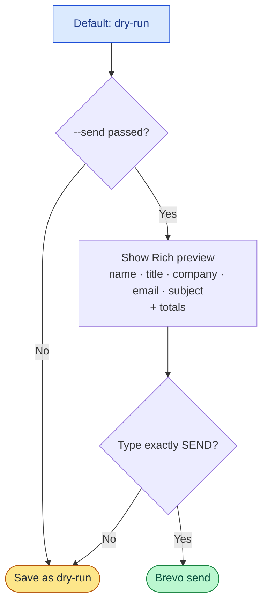

# AutoOutreach Pipeline

> A production-style **Python 3.11 CLI** that runs a full cold-outreach workflow from a single seed domain — find lookalike companies, discover decision-makers, enrich verified work emails, generate personalized copy, preview the send list, and dispatch through Brevo **only after explicit confirmation**.

<p align="center">
  
  
  
  
  
  
</p>

One input in. Every stage hands its output to the next. **No human touches the data in between.**

---

## Pipeline at a Glance

<table>
<tr>
<td width="42%" valign="top">



</td>
<td width="58%" valign="top">

| Stage | Tool | In → Out |
|-------|------|----------|
| **1. Discover** | Ocean.io | seed domain → similar company domains |
| **2. Find people** | Prospeo | domains → C-suite / VP + LinkedIn URLs |
| **3. Enrich** | Prospeo | profiles → verified work emails |
| **4. Write** | Jinja2 | contacts → personalized outreach copy |
| **5. Preview** | Rich | candidates → safety table + totals |
| **6. Send** | Brevo | approved emails → dispatched (gated) |

> The pipeline is **dry-run by default**. Even with `--send`, you must type exactly `SEND` before Brevo is ever called.

</td>
</tr>
</table>

> **Provider note:** Eazyreach remains in the codebase as an optional provider boundary but is **disabled by default** (free API access/credits were unavailable). Prospeo replaces it for both decision-maker discovery and email enrichment.

---

## Tech Stack

| Area | Choice |
|------|--------|
| Language | Python 3.11 |
| CLI | Typer |
| HTTP | httpx (async provider clients) |
| Models / Config | Pydantic + pydantic-settings |
| Env loading | python-dotenv |
| Resilience | tenacity (retry / backoff) |
| Terminal UX | Rich (tables, panels, safety previews) |
| Templating | Jinja2 |
| Storage | SQLite (run metadata) |
| Artifacts | JSON / CSV / Markdown |
| Quality | pytest + Ruff |

---

## Setup

```powershell
python -m venv .venv
.\.venv\Scripts\Activate.ps1
python -m pip install -e ".[dev]"
Copy-Item .env.example .env
```

Then add real credentials to `.env`. **Do not commit `.env`** — it is gitignored.

---

## Environment Variables

```env
# --- Company discovery (Ocean.io) ---
OCEAN_API_KEY=
OCEAN_BASE_URL=https://api.ocean.io
OCEAN_LOOKALIKE_ENDPOINT=/v3/search/companies
OCEAN_LOOKALIKE_METHOD=POST
OCEAN_AUTH_HEADER=x-api-token
OCEAN_AUTH_PREFIX=
OCEAN_SEED_DOMAIN_FIELD=domain
OCEAN_LIMIT_FIELD=limit
OCEAN_RESPONSE_COMPANIES_PATH=companies
OCEAN_COMPANY_NAME_FIELD=company.name
OCEAN_COMPANY_DOMAIN_FIELD=company.domain
OCEAN_COMPANY_SCORE_FIELD=relevance
OCEAN_LOOKALIKE_BODY_TEMPLATE={"size":{limit},"companiesFilters":{"lookalikeDomains":["{domain}"]}}
COMPANY_DISCOVERY_PROVIDER=ocean

# --- People + email enrichment (Prospeo) ---
PROSPEO_API_KEY=

# --- Optional provider boundary (disabled) ---
EAZYREACH_API_KEY=
EMAIL_PROVIDER=prospeo
EAZYREACH_ENABLED=false

# --- Sending (Brevo) ---
BREVO_API_KEY=
BREVO_SENDER_EMAIL=
BREVO_SENDER_NAME=
BREVO_SANDBOX=true
TEST_RECIPIENT=

# --- Defaults ---
DEFAULT_LIMIT=10
REQUEST_TIMEOUT_SECONDS=30
MAX_RETRIES=3
```

`BREVO_SANDBOX=true` sends Brevo requests with `X-Sib-Sandbox: drop`, so Brevo validates the request without delivering it. `TEST_RECIPIENT` is optional and handy for demos.

---

## Common Commands

**Validate local configuration**
```powershell
python main.py validate-env
```

**Run the mock demo (no API keys needed)**
```powershell
python main.py run --domain example.com --mock
```

**Run real providers in dry-run mode**
```powershell
python main.py run --domain apollo.io --limit 3
```
> Dry-run creates outreach emails and records `dry_run` send results, but does **not** send through Brevo.

**Provider smoke tests**
```powershell
python main.py test-provider ocean --domain apollo.io --debug
python main.py test-provider prospeo --domain apollo.io
python main.py test-provider brevo --sandbox
python main.py test-provider brevo --to myemail@example.com
```

**Probe Ocean directly (when checking API docs / config)**
```powershell
python main.py probe-ocean --method POST --endpoint "/v3/search/companies" --domain apollo.io --limit 1
```

**Safe send demo**
```powershell
python main.py run --domain apollo.io --limit 3 --send --test-recipient myemail@example.com
```
> With `--test-recipient`, every approved email is routed to your test inbox instead of the discovered prospect. The original intended recipient is written into the email body for review.

**Resume and export saved runs**
```powershell
python main.py resume --run-id <run-id>
python main.py export --run-id <run-id>
```

---

## Safety Model

The send path is gated in layers so emails never fire by accident:



- Default mode is **dry-run**.
- `--send` only *enables* the send path; it does not send immediately.
- Before sending, the CLI shows a Rich table (name, title, company, email, subject) plus totals for companies, contacts, verified emails, skipped emails, and duplicates removed.
- Sending proceeds **only** when the user types exactly `SEND`. Anything else skips sending and saves the run as dry-run.

---

## Saved Artifacts

Every run writes a self-contained, audit-friendly folder:

```text
data/runs/<timestamp>_<seed-domain>/
├─ run.json
├─ companies.json
├─ contacts.json
├─ email_candidates.json
├─ outreach_emails.csv
├─ send_results.json
└─ report.md
```

Run metadata is also stored in `data/runs.db`, and Ocean probe responses are saved under `data/debug/`.

---

## Tests and Quality

```powershell
python -m pytest
python -m ruff check .
```

Coverage includes domain validation, dedupe, deterministic email copy, safety-confirmation behavior, Ocean parsing/config, Prospeo parsing/enrichment, and mock pipeline end-to-end behavior.

---

## Tradeoffs

- **Eazyreach disabled** — optional, but free API access/credits were unavailable, so Prospeo fills that role.
- **Ocean stays configurable** — API docs and account access can expose different request shapes over time.
- **Robust mock mode** — lets the assignment be demonstrated without paid credits.
- **Deterministic email copy** — keeps tests and demos predictable.
- **Resume inspects saved artifacts** — it does not replay partially completed provider stages.

---

## Interview Talking Points

- Provider clients are **separated from pipeline orchestration**, so Ocean, Prospeo, Brevo, mocks, and optional Eazyreach can be swapped without rewriting the pipeline.
- Safety is enforced in layers: dry-run default → explicit `--send` → exact `SEND` confirmation → Brevo sandbox → `--test-recipient` demo routing.
- Each stage saves audit-friendly artifacts, plus SQLite metadata for run history.
- Provider failures are isolated per company/contact where possible, so one bad enrichment doesn't crash the run.
- The project ships realistic mocks, typed Pydantic models, async HTTP clients, retry/backoff, terminal UX, templated copy, exports, tests, and linting.